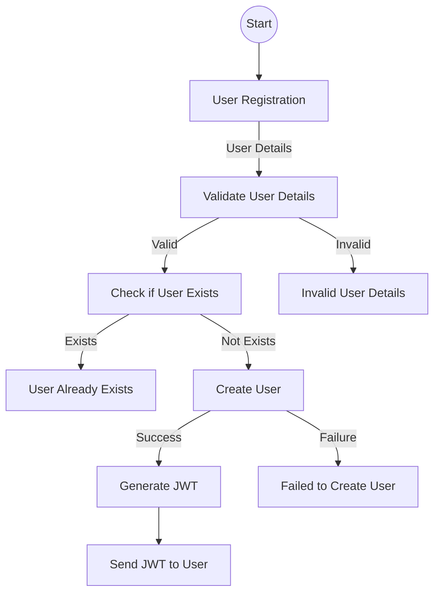
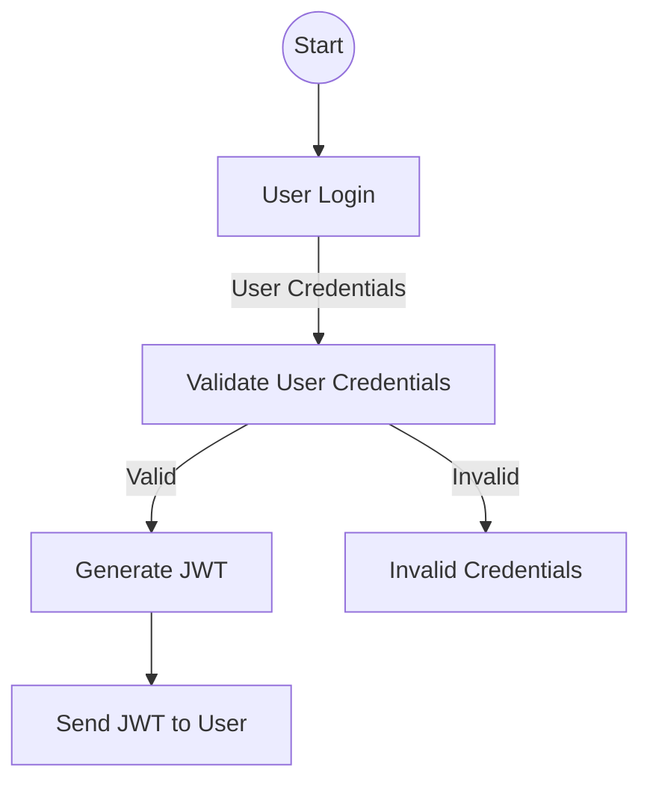
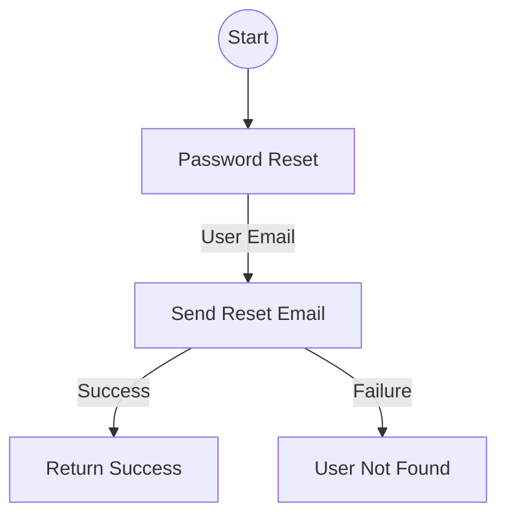
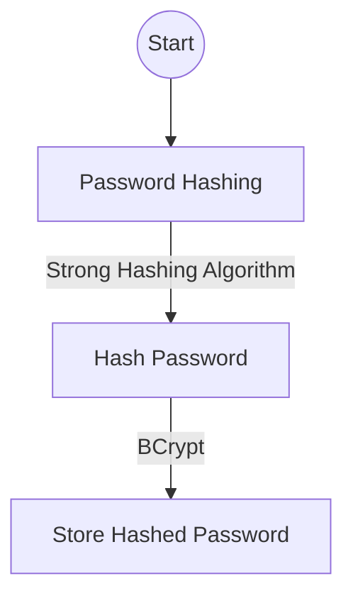
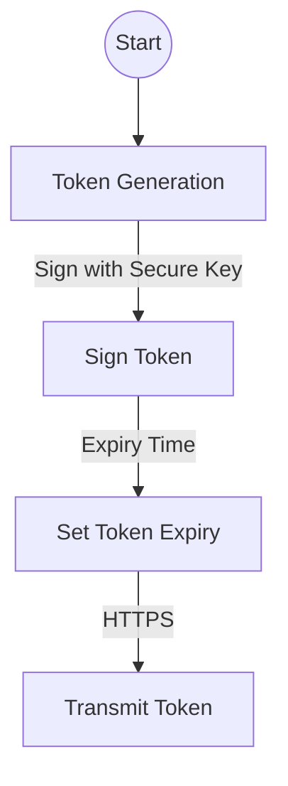

# Authentication Design

## Objective

The objective of this document is to outline the design of the authentication system for the task tracking application.

### Requirements

1. Users should be able to register with the system.
2. Registered users should be able to log in with their credentials.
3. Authentication should be secure and use industry-standard practices.
4. Users should be able to reset their password if they forget it.
5. The system should provide tokens for authenticated users to access protected resources.

### Authentication Flow

#### User Registration

- **Endpoint:** `/api/auth/register`
- **Method:** `POST`
- **Request Body:**

```json
{
  "username": "example_user",
  "email": "user@example.com",
  "password": "password123"
}
```

- **Response:**
- `200 OK` on successful registration
- `400 Bad Request` if the username or email is already taken



#### User Login

- **Endpoint:** `/api/auth/login`
- **Method:** `POST`
- **Request Body:**

```json
{
  "email": "user@example.com",
  "password": "password123"
}
```

- **Response:**
- `200 OK` on successful login
- `401 Unauthorized` if the credentials are incorrect



#### Password Reset

- **Endpoint:** `/api/auth/reset-password`
- **Method:** `POST`
- **Request Body:**

``` json
{
  "email": "user@example.com"
}
```

- **Response:**
- `200 OK` if the password reset email is sent successfully
- `404 Not Found` if the email is not associated with any user account



#### Token Generation

- JWT (JSON Web Token) will be used for token-based authentication.
- Tokens will be generated upon successful login and sent back to the client.
- The token should be sent in the Authorization header of subsequent requests.

### Security Measures

#### Password Hashing

- User passwords will be hashed using a strong hashing algorithm before storing them in the database.
- `BCrypt` will be used for password hashing.



#### JWT (JSON Web Token)

- Tokens will be signed using a secure key.
- Tokens will have an expiry time.
- Tokens will be transmitted securely over HTTPS.



### Database Schema

#### User Table

- **Fields:**
- `id` (Primary Key)
- `username`
- `email`
- `password_hash`

### Technology Stack

- **Framework:** ASP.NET
- **Database:** PostgreSQL Server
- **Authentication:** JWT

### Future Enhancements

#### Rate Limiting

Add rate limiting to the login endpoint to protect against brute-force attacks. This will limit the number of login attempts a user can make within a certain time period, reducing the risk of an attacker guessing a user's password through repeated attempts.

#### Password Policy

Enforce a strong password policy for better security. This policy will require passwords to be a certain length and include a mix of uppercase and lowercase letters, numbers, and special characters.


#### Refresh Tokens

 Implement refresh tokens for maintaining user sessions with short-lived access tokens. A refresh token can be used to get a new access token when the old one expires, without requiring the user to log in again. This provides a balance between security and user convenience.

#### Email Verification

Add email verification after registration to confirm the user's email address.
