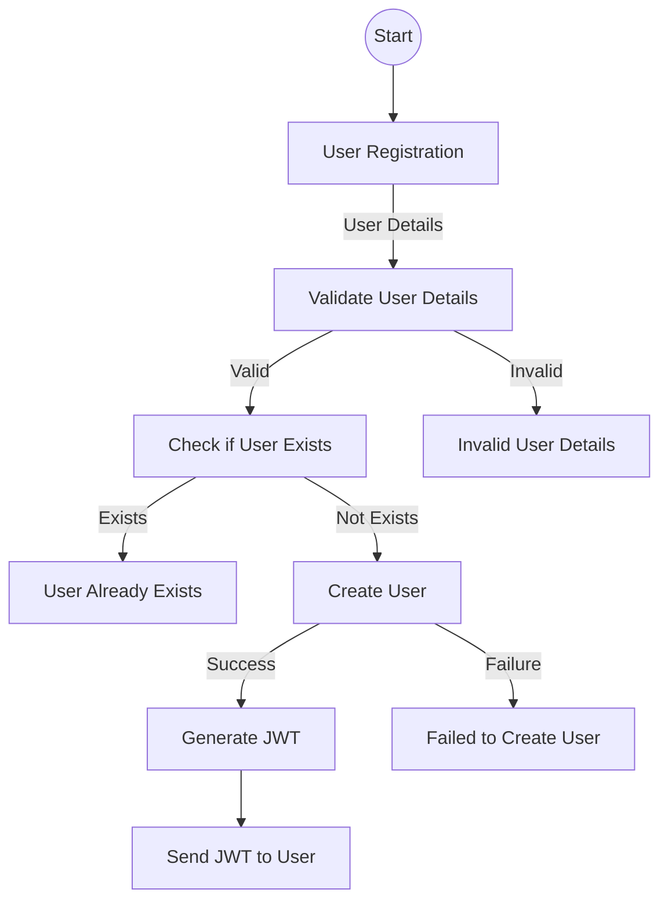
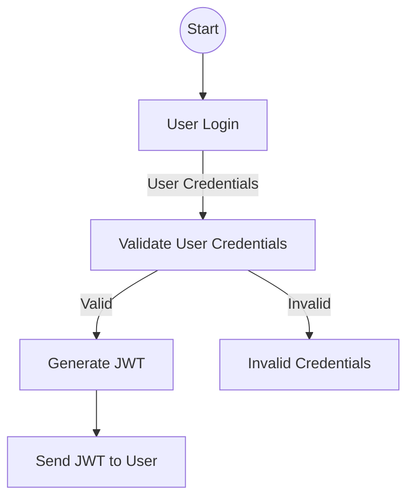
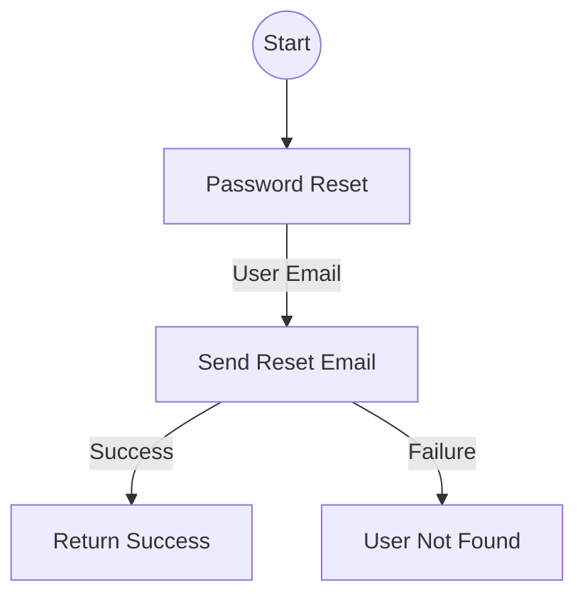
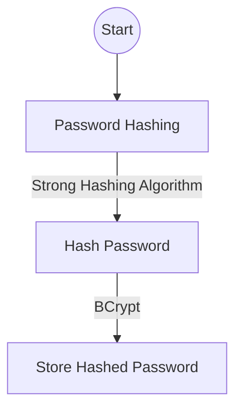
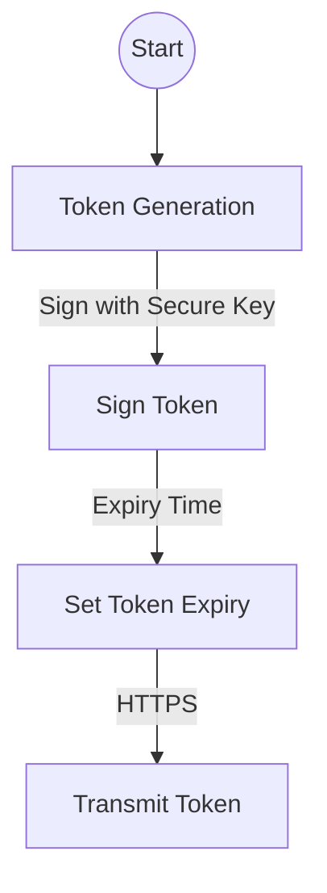
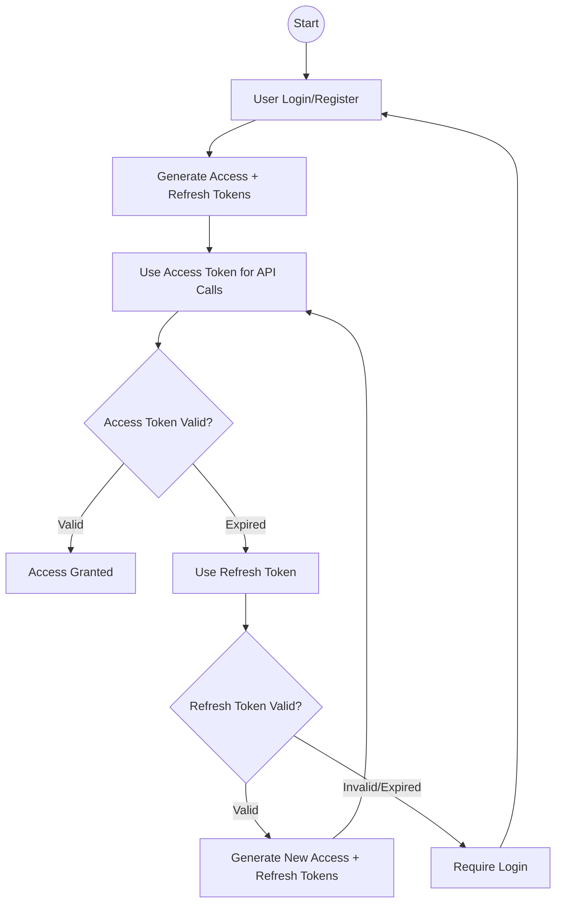

# Authentication Design

## Objective

The objective of this document is to outline the design of the authentication system for the task tracking application.

### Requirements

1. Users should be able to register with the system.
2. Registered users should be able to log in with their credentials.
3. Authentication should be secure and use industry-standard practices.
4. Users should be able to reset their password if they forget it.
5. The system should provide tokens for authenticated users to access protected resources.

### Authentication Flow

#### User Registration

- **Endpoint:** `/api/auth/register`
- **Method:** `POST`
- **Request Body:**

```json
{
  "username": "example_user",
  "email": "user@example.com",
  "password": "password123"
}
```

- **Response:**
- `200 OK` on successful registration
- `400 Bad Request` if the username or email is already taken



#### User Login

- **Endpoint:** `/api/auth/login`
- **Method:** `POST`
- **Request Body:**

```json
{
  "email": "user@example.com",
  "password": "password123"
}
```

- **Response:**
- `200 OK` on successful login
- `401 Unauthorized` if the credentials are incorrect



#### Password Reset

- **Endpoint:** `/api/auth/reset-password`
- **Method:** `POST`
- **Request Body:**

``` json
{
  "email": "user@example.com"
}
```

- **Response:**
- `200 OK` if the password reset email is sent successfully
- `404 Not Found` if the email is not associated with any user account



#### Token Generation

- JWT (JSON Web Token) will be used for token-based authentication.
- Tokens will be generated upon successful login and sent back to the client.
- The token should be sent in the Authorization header of subsequent requests.

### Security Measures

#### Password Hashing

- User passwords will be hashed using a strong hashing algorithm before storing them in the database.
- `BCrypt` will be used for password hashing.



#### JWT (JSON Web Token)

- Tokens will be signed using a secure key.
- Tokens will have an expiry time.
- Tokens will be transmitted securely over HTTPS.



#### Refresh Tokens

Refresh tokens provide a secure way to maintain user sessions without requiring frequent re-authentication. Our implementation uses a **dual-token strategy** combining short-lived access tokens with long-lived refresh tokens.

**Why Two Different Token Types?**

Understanding the fundamental difference between access tokens and refresh tokens is crucial for secure authentication:

**Access Token (JWT - JSON Web Token):**

- **Purpose**: Grants access to protected resources
- **Structure**: Self-contained with user claims (ID, username, email)
- **Validation**: Stateless - no database lookup required
- **Lifespan**: Short (1 hour) - limits exposure if compromised
- **Format**: `header.payload.signature` ([Learn more about JWTs](https://jwt.io/introduction))

**Refresh Token (Opaque Token):**

- **Purpose**: Obtains new access tokens when they expire
- **Structure**: Random cryptographic string with no embedded data
- **Validation**: Stateful - requires database lookup to validate
- **Lifespan**: Long (7 days) - provides user convenience
- **Format**: Base64-encoded random bytes ([Learn about refresh token security](https://auth0.com/blog/refresh-tokens-what-are-they-and-when-to-use-them/))

**Security Benefits of This Approach:**

- **Principle of Least Privilege**: Access tokens have minimal lifespan
- **Defense in Depth**: Even if access token is stolen, damage is limited to 1 hour
- **Revocation Control**: Refresh tokens can be invalidated in the database
- **Reduced Attack Surface**: Different token types serve different purposes

**Implementation Details:**

- **Access Token Expiry**: 1 hour
- **Refresh Token Expiry**: 7 days
- **Storage**: Refresh tokens are stored in the database with the user record
- **Security**: Refresh tokens are cryptographically secure random 64-byte tokens
- **Token Rotation**: Each refresh generates both new access and refresh tokens

**Refresh Token Flow:**

- **Endpoint:** `/api/auth/refresh`
- **Method:** `POST`
- **Request Body:**

```json
{
  "refreshToken": "your-refresh-token-here"
}
```

- **Response:**
- `200 OK` with new tokens on successful refresh
- `401 Unauthorized` if the refresh token is invalid or expired

**Complete Authentication Flow with Refresh Tokens:**



**Code Implementation:**

```csharp
// Access Token Generation (JWT with claims)
private string GenerateJwtToken(User user)
{
    var claims = new[]
    {
        new Claim(ClaimTypes.NameIdentifier, user.Id.ToString()),
        new Claim(ClaimTypes.Name, user.Username),
        new Claim(ClaimTypes.Email, user.Email)
    };
    // ... JWT creation logic
}

// Refresh Token Generation (Random bytes)
private string GenerateRefreshToken()
{
    var randomBytes = new byte[64];
    using var rng = RandomNumberGenerator.Create();
    rng.GetBytes(randomBytes);
    return Convert.ToBase64String(randomBytes);
}
```

**Additional Resources:**

- [OAuth 2.0 RFC 6749 - Refresh Tokens](https://tools.ietf.org/html/rfc6749#section-1.5)
- [OWASP JWT Security Cheat Sheet](https://cheatsheetseries.owasp.org/cheatsheets/JSON_Web_Token_for_Java_Cheat_Sheet.html)
- [Microsoft's Token Refresh Best Practices](https://docs.microsoft.com/en-us/azure/active-directory/develop/refresh-tokens)

### Database Schema

#### User Table

- **Fields:**
  - `id` (Primary Key)
  - `username`
  - `email`
  - `password_hash`
  - `refresh_token` (Nullable) - Stores the current refresh token
  - `refresh_token_expiry` (Nullable) - Expiration timestamp for refresh token
  - `created_at` - User registration timestamp
  - `updated_at` - Last modification timestamp

**Database Migration:**

```bash
dotnet ef migrations add AddRefreshTokenFields
dotnet ef database update
```

### Technology Stack

- **Framework:** ASP.NET
- **Database:** PostgreSQL Server
- **Authentication:** JWT

### Future Enhancements

#### Rate Limiting

Add rate limiting to the login endpoint to protect against brute-force attacks. This will limit the number of login attempts a user can make within a certain time period, reducing the risk of an attacker guessing a user's password through repeated attempts.

#### Password Policy

Enforce a strong password policy for better security. This policy will require passwords to be a certain length and include a mix of uppercase and lowercase letters, numbers, and special characters.

#### Email Verification

Add email verification after registration to confirm the user's email address.

#### Key Updates

1. **JWT Secret Configuration**:
   - Added a `Jwt:Secret` configuration in `appsettings.Development.json` to ensure a secure key is used for token generation.
   - The secret must be at least 256 bits (32 characters) to comply with HMAC-SHA256 requirements.

2. **Password Security**:
   - Removed the plain text `Password` property from the `User` model to enhance security.
   - Passwords are now stored only as hashed values using `BCrypt`.

3. **Error Handling**:
   - Improved error handling in the `AuthService` to provide more descriptive error messages.

4. **Controller Updates**:
   - Updated the `AuthController` to align with the changes in the `AuthService`.

5. **Refresh Token Implementation**:
   - Added `RefreshToken` and `RefreshTokenExpiry` fields to the User model.
   - Implemented refresh token generation using cryptographically secure random bytes.
   - Created `/api/auth/refresh` endpoint for token renewal.
   - Updated JWT configuration to allow 5-minute clock skew for seamless token renewal.

#### Migration Steps

- Ensure the `Jwt:Secret` is configured in your environment.
- Run the following commands to update the database schema:

  ```bash
  # Original migration for basic user authentication
  dotnet ef migrations add UpdateTableMigration

  # New migration for refresh token support
  dotnet ef migrations add AddRefreshTokenFields

  # Apply all migrations to database
  dotnet ef database update
  ```

#### Testing

- Test the `Register`, `Login`, and `ResetPassword` endpoints to ensure they work as expected.
- Verify that passwords are hashed and no plain text passwords are stored in the database.

#### Notes

- The `Jwt:Secret` must be kept secure and should not be hardcoded in the source code.
- Use environment variables or a secure secrets manager for production environments.
